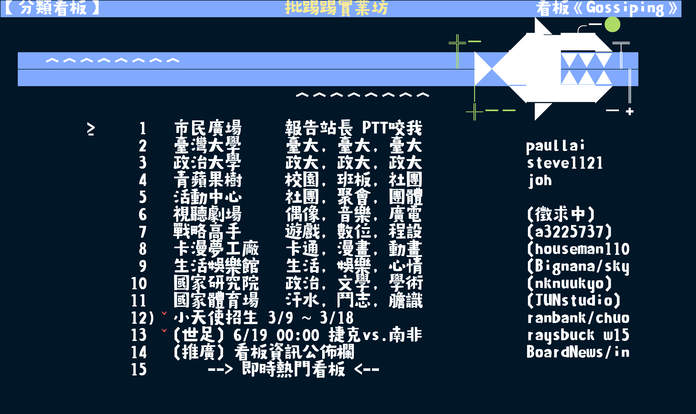

# PTT Font Tool

<p align="center">
  
</p>

<p align="center">
  
  <br>
  <sub>截圖範例使用 <a href="https://www.sentyfont.com/watermelon.htm">新蒂西瓜体</a> 搭配 <a href="https://github.com/mbadolato/iTerm2-Color-Schemes/blob/61c5479/schemes/Night%20Owl.itermcolors">Night Owl</a>。顏色主題可搭配 <a href="https://chromewebstore.google.com/detail/term-ptt-custom-theme/lmanknmemlpnjolgjoffdkmkkeibpfej">Term PTT Custom Theme</a> 套用，原始碼見 <a href="https://github.com/VdustR/term-ptt-custom-theme">GitHub</a>。</sub>
</p>

桌面版、CLI 與 Python library 工具，用來把字型調整成適合 term.ptt.cc 終端機格線的版本。

## Desktop

桌面版是主要的使用者介面。

主要功能：

- 開啟本機字型檔。
- 用投入字型即時編輯預覽文字。
- 顯示字型 metadata、audit summary 與 fallback glyph coverage。
- 管理 fallback font stack 與 Noto fallback cache。
- 切換 `center` / `fit` 處理策略。
- 建立並匯出適合 PTT 使用的本機輸出檔。

桌面版 release artifacts 會把需要的 runtime dependencies 一起打包，讓使用者下載後可以直接執行，不要求使用者自行安裝 Python、fontTools、Brotli 或其他 runtime dependencies。

下載桌面版請前往 [GitHub Releases](https://github.com/VdustR/ptt-font-tool/releases/latest)，選擇最新版中的 macOS、Windows 或 Linux artifact。

本地開發版可以用 desktop extra 啟動：

```bash
python -m pip install -e '.[desktop]'
ptt-font-desktop
```

桌面版目前支援開啟本機字型、用投入字型預覽文字、顯示 metadata、顯示 audit summary、管理 fallback glyph coverage、切換 `center` / `fit`、產生可預覽與匯出的完整處理字型，以及匯出並驗證處理後的字型。

Noto fallback 會由桌面版下載到應用程式自己的 cache，不會安裝到系統字型。使用者可以在 fallback 區塊下載、重新下載、清空，或打開 cache 資料夾，並選擇 `Noto Sans TC` 或 `Noto Serif TC` 作為文字 fallback。

桌面版可以檢查 GitHub Releases 是否有新版；目前只會提示並開啟 release 頁面，不會自動下載、替換或執行更新檔。

Release 會由 GitHub Actions 自動產生桌面版 artifacts：

- `ptt-font-tool-vX.Y.Z-macos-arm64.zip`
- `ptt-font-tool-vX.Y.Z-macos-x64.zip`
- `ptt-font-tool-vX.Y.Z-windows-x64.zip`
- `ptt-font-tool-vX.Y.Z-linux-x64.tar.gz`

每個 artifact 會一起上傳對應的 `.sha256` checksum 檔。

目前桌面版 artifacts 尚未 code sign 或 notarize。macOS 與 Windows 第一次開啟下載版 app 時，可能會出現作業系統安全提醒；請只從本 repository 的 GitHub Releases 下載。

下載後可以先驗證 checksum：

```bash
shasum -a 256 -c ptt-font-tool-vX.Y.Z-macos-arm64.zip.sha256
```

Windows PowerShell 可以用：

```powershell
Get-FileHash .\ptt-font-tool-vX.Y.Z-windows-x64.zip -Algorithm SHA256
```

再與 `.sha256` 檔案內容比對。

### macOS 手動開啟未簽章版本

只對你信任來源的版本使用這個方式，例如本 repository 的 GitHub Releases。不要對不明來源下載的 app 套用例外。

如果 macOS 阻擋開啟未簽章的 `PTT Font Tool.app`：

1. 先雙擊 `PTT Font Tool.app`，讓 macOS 顯示一次安全提醒。
2. 打開 **System Settings** → **Privacy & Security**。
3. 往下找到 **Security** 區塊，按 **Open Anyway**。
4. 再按 **Open** 確認。

如果 **Open Anyway** 沒出現，可以只針對這個 app 移除 quarantine 屬性：

```bash
xattr -dr com.apple.quarantine "$HOME/Downloads/PTT Font Tool.app"
```

如果你已經把 app 移到 `/Applications`：

```bash
xattr -dr com.apple.quarantine "/Applications/PTT Font Tool.app"
```

不建議全域關閉 Gatekeeper。上面的方式只會替單一 app 建立例外。

## CLI

CLI 用於可重複執行的本機流程與自動化。

目前指令：

```bash
ptt-font audit input.otf
ptt-font patch input.otf --output output.otf --strategy center
ptt-font build primary.ttf fallback-a.ttf fallback-b.ttf --output output.ttf --noto sans
ptt-font verify output.otf
```

`audit` 會列出不符合 PTT cell 寬度的 glyph，但即使發現問題也會 exit `0`，適合人工檢查。

`verify` 會輸出同樣的檢查結果；全部符合時 exit `0`，有 mismatch 或 missing glyph 時 exit `1`，適合 CI 或 script 使用。

`audit`、`patch`、`verify` 都支援 `--sample-text`。不指定 `--sample-text` 時，會處理或檢查字型 cmap 映射到的所有 Unicode 字元。

省略 `--output` 時，處理後的字型會輸出在輸入檔旁邊，檔名預設加上 `-ptt` 後綴。

```bash
ptt-font patch lithue-1.1.otf --sample-text "A漢ˇ"
# 產生 lithue-1.1-ptt.otf
```

`build` 是新的多字型流程。第一個 path 是主要字型，後面的 path 依序作為 fallback font。缺字會先從 fallback stack 補，最後才使用已下載的 Noto fallback。

```bash
ptt-font build SentyWatermelon.ttf MingLiU-PTT.ttf \
  --output SentyWatermelon-ptt.ttf \
  --strategy center \
  --noto sans
```

`--noto` 支援 `sans`、`serif`、`off`。預設不會自動下載 Noto，避免 CLI 在 build 時產生未預期的 network side effect。需要 build 前自動補齊 Noto cache 時，可以加上：

```bash
ptt-font build input.ttf fallback.ttf --download-noto
```

Noto cache 可以獨立管理：

```bash
ptt-font noto status --noto sans
ptt-font noto download --noto sans
ptt-font noto clear --noto sans
ptt-font noto path
```

設定來源優先序是 CLI args 優先，接著才讀 env var，最後使用作業系統預設值。

可用 env var：

- `PTT_FONT_TOOL_FONTS_DIR`：app-managed fonts root；Noto 會放在底下的 `noto/`。
- `PTT_FONT_TOOL_NOTO_STYLE`：`sans`、`serif` 或 `off`。
- `PTT_FONT_TOOL_FALLBACK_FONTS`：fallback font path list，使用作業系統 path separator 分隔，例如 macOS/Linux 用 `:`、Windows 用 `;`。

處理策略：

- `center`：保留 glyph 外形與尺寸，將 glyph 置中放進 PTT cell，允許視覺上溢出或重疊。
- `fit`：只對超出 PTT cell 的 glyph 做水平縮放，再置中。

處理後的字型會移除 OpenType `GPOS` pair positioning/kerning，避免瀏覽器 shaping 時微調字距而破壞終端機固定格線。

## Library

Python library 提供桌面版與 CLI 共用的核心邏輯。

目前模組：

- `ptt_font_tool.profile`：將 Unicode 字元映射到 Term PTT cell 寬度。
- `ptt_font_tool.audit`：讀取字型，檢查 glyph advance width 是否符合 Term PTT profile。
- `ptt_font_tool.patch`：修改 glyph advance width，並套用 `center` 或 `fit` outline 策略。
- `ptt_font_tool.fallback`：依照 fallback chain 合併缺少的 glyph。
- `ptt_font_tool.noto_cache`：管理 app cache 中的 Noto fallback 下載、狀態與清除。
- `ptt_font_tool.font_stack`：提供 CLI 與桌面版共用的多字型 stack、Noto resolver 與 build entrypoint。

## Font Width Model 字寬模型

term.ptt.cc 使用終端機常見的 2:1 cell 寬度：

- ASCII 與半形字元使用一個 cell。
- CJK、全形、寬字元，以及 East Asian Ambiguous 字元使用兩個 cell。
- 1000 UPEM 字型中，一個 cell 預期是 500 font units，兩個 cell 預期是 1000 font units。
- 1200 UPEM 字型中，一個 cell 預期是 600 font units，兩個 cell 預期是 1200 font units。

預設 profile 使用 Python 的 Unicode East Asian Width 資料，並且針對 term.ptt.cc 將 ambiguous-width 字元視為寬字元。

## Current Limits 目前限制

- Audit 與 advance patching 依照 fontTools 支援的 OpenType 與 TrueType 輸入格式。
- Outline strategies 目前支援 TrueType `glyf` 與 CFF-based OTF 字型。
- CFF2、variable font 行為、color glyph outlines 還需要更多相容性測試，才會視為正式支援路徑。

## Development

建立隔離的 Python environment 並安裝 package：

```bash
python -m venv .venv
. .venv/bin/activate
python -m pip install -e .
```

執行測試：

```bash
python -m unittest discover -s tests
```

## Release 發布

這個 repository 使用 Release Please 管理版本與自動化 release。

Release 建立後，GitHub Actions 會自動建置並上傳：

- 已包含 runtime dependencies 的桌面版 artifacts。
- 每個 artifact 對應的 `.sha256` checksum 檔。

## License And Font Rights 授權與字型權利

本專案使用 MIT 授權。

輸入字型仍受原始字型授權約束。產生後的字型只能依照原始輸入字型授權使用或散布。本工具不會授予第三方字型的再散布權利。
